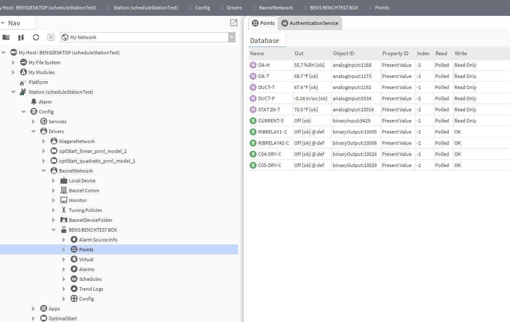
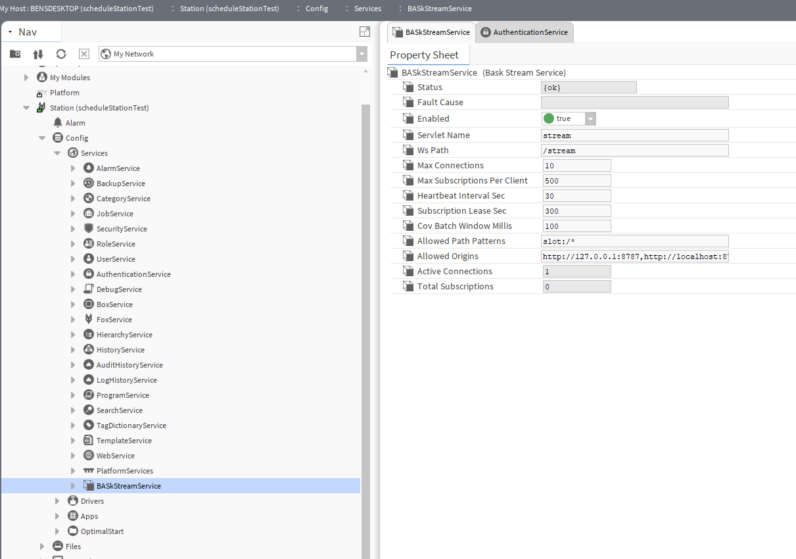

# Python baskStream test tools

This was tested on a bench setup with a BACnet MS/TP device integrated into the Niagara station through a BACnet router. 




Validation was performed in Python from both the Windows machine (192.168.204.11) running the station locally and a Linux device on the same test-bench LAN.


## Py packages

Install these Python packages:

```text
requests
websocket-client
msgpack
````

Example:

```bash
pip install requests websocket-client msgpack
```


## Files

```text
tools/python/
  baskstream_client.py   # reusable Niagara SCRAM + MessagePack WebSocket client
  baskstream_cli.py      # practical CLI: health, smoke, tree, values, read, schedules
  baskstream_smoke.py    # minimal smoke test
  requirements.txt
```

## Station prerequisites

1. Install `baskStream-rt.jar` on the Niagara station host.
2. Restart the station.
3. Add `BASkStreamService` under station services.
4. Verify the service is enabled and its servlet name is `stream`.
5. Use a Niagara user that can log into station web and browse/read the target station paths.
6. Confirm the station web port is reachable from the client machine.

For local/self-signed test benches, the scripts default to TLS verification off. Use `--verify-tls` only when the station certificate is trusted by the client machine.

## Quick network check

Unauthenticated `/stream/health` should usually redirect to Niagara login. That is a good sign because it proves the remote machine can reach the Niagara web server and the `stream` servlet path.

### Windows PowerShell

```powershell
curl.exe -k -i https://localhost/stream/health
curl.exe -k -i https://192.168.204.11/stream/health
```

Expected before login:

```text
HTTP/1.1 302 Found
Location: https://<station>/login
```

### Linux bash

```bash
curl -k -i https://192.168.204.11/stream/health
nc -vz 192.168.204.11 443
```

### macOS zsh/bash

```zsh
curl -k -i https://192.168.204.11/stream/health
nc -vz 192.168.204.11 443
```

On macOS, if `nc` behaves differently, use:

```zsh
nmap -Pn -p 443 192.168.204.11
```


## PowerShell ORD quoting

Niagara slot ORDs commonly contain `$20`, `$2d`, `$23`, etc.

In PowerShell, **always wrap Niagara ORDs in single quotes**. Double quotes will treat `$20BENCHTEST` like a PowerShell variable and corrupt the ORD.

Good:

```powershell
--base 'slot:/Drivers/BacnetNetwork/BENS$20BENCHTEST$20BOX/points'
```

Bad:

```powershell
--base "slot:/Drivers/BacnetNetwork/BENS$20BENCHTEST$20BOX/points"
```

Linux bash and macOS zsh should also use single quotes for Niagara ORDs. It is safer and avoids shell expansion surprises.

## Credentials

Prefer `--ask-pass` for interactive testing.

### Windows PowerShell

```powershell
py .\baskstream_cli.py --station https://localhost --user admin --ask-pass health
```

Or use environment variables:

```powershell
$env:BASKSTREAM_USER="admin"
$env:BASKSTREAM_PASS="<station-password>"
```

### Linux bash

```bash
python3 baskstream_cli.py --station https://192.168.204.11 --user admin --ask-pass health
```

Or use environment variables:

```bash
export BASKSTREAM_USER="admin"
export BASKSTREAM_PASS="<station-password>"
```

### macOS zsh/bash

```zsh
python3 baskstream_cli.py --station https://192.168.204.11 --user admin --ask-pass health
```

Or use environment variables:

```zsh
export BASKSTREAM_USER="admin"
export BASKSTREAM_PASS="<station-password>"
```

Do not commit real station credentials.

## Smoke test

### Windows PowerShell, local station

```powershell
py .\baskstream_smoke.py `
  --station https://localhost `
  --user admin `
  --ask-pass `
  --root 'slot:/Drivers'
```

### Linux bash, remote station

```bash
python3 baskstream_smoke.py \
  --station https://192.168.204.11 \
  --user admin \
  --ask-pass \
  --root 'slot:/Drivers'
```

### macOS zsh/bash, remote station

```zsh
python3 baskstream_smoke.py \
  --station https://192.168.204.11 \
  --user admin \
  --ask-pass \
  --root 'slot:/Drivers'
```

Expected result:

```text
[login] authenticatedUser=admin
[ws] connecting wss://<station>/stream
[capabilities] apiVersion=1.2
[browse] slot:/Drivers
- NiagaraNetwork | slot:/Drivers/NiagaraNetwork | niagaraDriver:NiagaraNetwork {ok}
- BacnetNetwork  | slot:/Drivers/BacnetNetwork  | bacnet:BacnetNetwork {ok}

OK: baskStream smoke test completed.
```

## Print a compact tree

### Windows PowerShell

```powershell
py .\baskstream_cli.py `
  --station https://localhost `
  --user admin `
  --ask-pass `
  tree `
  --base 'slot:/Drivers/BacnetNetwork' `
  --depth 4
```

### Linux bash

```bash
python3 baskstream_cli.py \
  --station https://192.168.204.11 \
  --user admin \
  --ask-pass \
  tree \
  --base 'slot:/Drivers/BacnetNetwork' \
  --depth 4
```

### macOS zsh/bash

```zsh
python3 baskstream_cli.py \
  --station https://192.168.204.11 \
  --user admin \
  --ask-pass \
  tree \
  --base 'slot:/Drivers/BacnetNetwork' \
  --depth 4
```

The tree command skips child links that jump outside the requested base by default. This prevents a BACnet device browse from unexpectedly expanding into the entire station through a `slot:/` child. Use `--follow-external` only when intentionally exploring cross-links.

## Print BACnet point names and values

### Windows PowerShell

```powershell
py .\baskstream_cli.py `
  --station https://localhost `
  --user admin `
  --ask-pass `
  values `
  --base 'slot:/Drivers/BacnetNetwork/BENS$20BENCHTEST$20BOX/points'
```

### Linux bash

```bash
python3 baskstream_cli.py \
  --station https://192.168.204.11 \
  --user admin \
  --ask-pass \
  values \
  --base 'slot:/Drivers/BacnetNetwork/BENS$20BENCHTEST$20BOX/points'
```

### macOS zsh/bash

```zsh
python3 baskstream_cli.py \
  --station https://192.168.204.11 \
  --user admin \
  --ask-pass \
  values \
  --base 'slot:/Drivers/BacnetNetwork/BENS$20BENCHTEST$20BOX/points'
```

Example output:

```text
Point          Value   Status       Type                  ORD
-------------------------------------------------------------
OA-T           75.07   {ok}         control:NumericPoint  slot:/...
DUCT-T         52.94   {ok}         control:NumericPoint  slot:/...
CURRENT-S      false   {ok}         control:BooleanPoint  slot:/...
```

Filter by name/ORD/type:

```bash
python3 baskstream_cli.py \
  --station https://192.168.204.11 \
  --user admin \
  --ask-pass \
  values \
  --base 'slot:/Drivers/BacnetNetwork/BENS$20BENCHTEST$20BOX/points' \
  --query temp
```

List point ORDs without reading values:

```bash
python3 baskstream_cli.py \
  --station https://192.168.204.11 \
  --user admin \
  --ask-pass \
  values \
  --base 'slot:/Drivers/BacnetNetwork/BENS$20BENCHTEST$20BOX/points' \
  --list-only
```

Read one explicit point:

```bash
python3 baskstream_cli.py \
  --station https://192.168.204.11 \
  --user admin \
  --ask-pass \
  read 'slot:/Drivers/BacnetNetwork/BENS$20BENCHTEST$20BOX/points/OA$2dT'
```

## Export values

### CSV

Windows PowerShell:

```powershell
py .\baskstream_cli.py `
  --station https://localhost `
  --user admin `
  --ask-pass `
  values `
  --base 'slot:/Drivers/BacnetNetwork/BENS$20BENCHTEST$20BOX/points' `
  --format csv `
  --output bacnet_values.csv
```

Linux/macOS:

```bash
python3 baskstream_cli.py \
  --station https://192.168.204.11 \
  --user admin \
  --ask-pass \
  values \
  --base 'slot:/Drivers/BacnetNetwork/BENS$20BENCHTEST$20BOX/points' \
  --format csv \
  --output bacnet_values.csv
```

### JSON

```bash
python3 baskstream_cli.py \
  --station https://192.168.204.11 \
  --user admin \
  --ask-pass \
  values \
  --base 'slot:/Drivers/BacnetNetwork/BENS$20BENCHTEST$20BOX/points' \
  --format json \
  --output bacnet_values.json
```

### Markdown table

```bash
python3 baskstream_cli.py \
  --station https://192.168.204.11 \
  --user admin \
  --ask-pass \
  values \
  --base 'slot:/Drivers/BacnetNetwork/BENS$20BENCHTEST$20BOX/points' \
  --format markdown
```

## Schedules

List schedules from the whole station, depth-limited.

Windows PowerShell:

```powershell
py .\baskstream_cli.py `
  --station https://localhost `
  --user admin `
  --ask-pass `
  schedules `
  --base 'slot:/' `
  --depth 5
```

Linux/macOS:

```bash
python3 baskstream_cli.py \
  --station https://192.168.204.11 \
  --user admin \
  --ask-pass \
  schedules \
  --base 'slot:/' \
  --depth 5
```

Read schedule summaries where supported:

```bash
python3 baskstream_cli.py \
  --station https://192.168.204.11 \
  --user admin \
  --ask-pass \
  schedules \
  --base 'slot:/' \
  --depth 5 \
  --read
```

